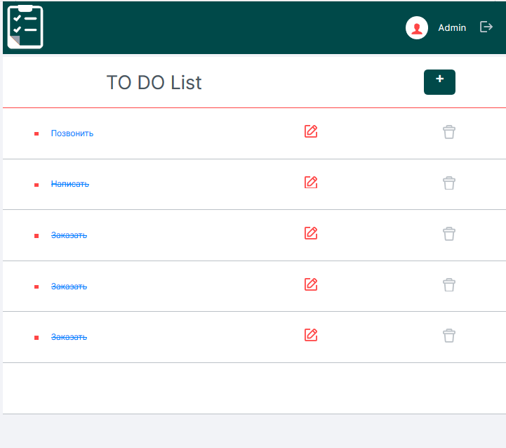
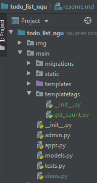
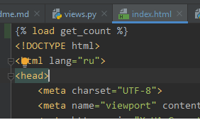
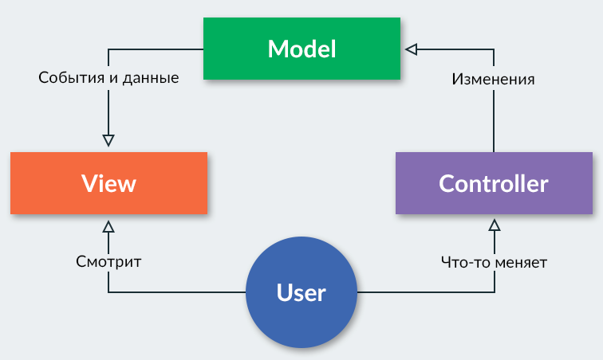
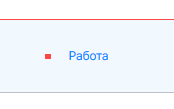
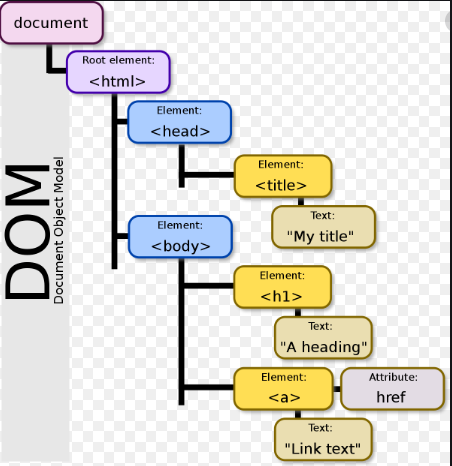

# УРОК №2
## БД подключение, донастройка рабочего окружения
- Какие БД поддерживает джанга
- Почему PostgresSQL?  
https://postgrespro.ru/education/courses
- Команды для активации виртуального окружения   

**windows**
```yaml
deactivate
venv\Scripts\activate.bat
```
**mac\linux**
```yaml
deactivate
source venv\bin\activate
```
- Установка драйверов **pip install psycop2**
- Прописать базу в settings.py
```python
DATABASES = {
    'default': {
        "ENGINE": "django.db.backends.postgresql",
        "HOST": "127.0.0.1",
        "NAME": "postgres",
        "USER": "postgres",
        "PASSWORD": "fred",
        "PORT": 5432
    }
}
```
- Миграции
https://docs.djangoproject.com/en/3.0/topics/migrations/
```yaml
python manage.py migrate
python manage.py makemigrations
python manage.py showmigrations
```
- Создание суперпользователя
```yaml
python manage.py createsuperuser
```
- Изучили, служебные таблицы
## Templates
https://docs.djangoproject.com/en/3.0/ref/templates/
## Д\З
- Повторить проделанные нами операции по подключению БД
- Создать новое приложение(app) **django-admin startapp list_item**
- Написать к нему вьюху
- Сделать шаблон(template) по аналогии с main и заполнить данными из словаря

- Добавить стиль CSS "id_done" в верстку
- *Создать свой **templatetag**, и с помощью него реализовать следующую задачу 
(на главной странице).  
У нас на странице создается столько строк, сколько мы передаем строк данных,
но выглядит не очень красиво если строк мало. 
Нужно (только средствами языка шаблонов) сделать так, чтобы
если нам передается строк меньше чем **6шт**, добить пустыми div блоками 
страницу, чтобы в сумме было 6шт блоков.  
-> Например 3 заполненных, 3 пустых.  
-> Если передаем 5 строк с данными то соответсвенно 5 заполненных 1 пустой.  
-> Если передаем 8 строк с данными - 8 заполненных блоков.  

Пример:  



Ссылка на документацию:
https://docs.djangoproject.com/en/3.0/howto/custom-template-tags/  
Не забываем также создать папку **templatetags**, в которой нужно разместить модуль с функцией тега:  


Также нужно дополнительно зарегистрировать нашу библиотеку тегов в 
**settings.py**  
```python
INSTALLED_APPS = [
    'django.contrib.admin',
    'django.contrib.auth',
    'django.contrib.contenttypes',
    'django.contrib.sessions',
    'django.contrib.messages',
    'django.contrib.staticfiles',
    'main',
    'main.templatetags'
]
```
И подгрузить библиотеку тегов на страницу шаблона:  


# УРОК №3
## Наследование шаблонов
- теги block, extend
```



    <title>Главная</title>



    <div class="table-data_table-header-item-1">TO DO List</div>

```
## Оптимизация роутинга URL
- функций include, и app_name = 'main'
```python
# \todo_list_ngu\todo_list_ngu\urls.py
urlpatterns = [
    path('admin/', admin.site.urls),
    path('', include('main.urls')),
    path('list/', include('list.urls')),
]

# \todo_list\main\urls.py
app_name = 'main'

urlpatterns = [
    path('', main_view, name='main'),
    path('create/', create_new_list, name='create')
]
```
- Обрашение в темплейте по app_name
```python
 <a href=''>
```
## Django ORM
Архитектура MVC  


ORM (англ. Object-Relational Mapping, рус. объектно-реляционное отображение, или 
преобразование) — технология программирования, которая 
связывает базы данных с концепциями объектно-ориентированных языков программирования  

**Django ORM Cookbook**  
https://prglb.ru/3h66k

**Офиц. документация**  
https://docs.djangoproject.com/en/3.0/ref/models/querysets/#


Рассмотрим:
- Проектирование БД  
https://docs.google.com/spreadsheets/d/1He-IVLLfwQv6MOhD6RbKyt3sItyfoAXgc98_c3ZSIo8/edit?usp=sharing
- model.Model
- Создание модели ListModel, типы данных
- Миграции
- Подключение модели к Админке  

main\admin.py
```python
from django.contrib import admin
from main.models import ListModel


class ListAdmin(admin.ModelAdmin):
    list_display = ['id', 'created', 'name', 'is_done', 'user']
    list_filter = ['created', 'name', 'is_done', 'user']
    search_fields = ['name', 'user']


admin.site.register(ListModel, ListAdmin)
```

## Д\З
- Синхронизировать код.
- Создание модели ListItemModel
- Миграции
- Добавить ListItemModel в админку

# УРОК №4
## Django ORM продолжение...
- Дескрипторы
```python
class AgeCheck:
    """
    Дескриптор
    """
    def __get__(self, instance, owner):
        return instance.__dict__[self.name]

    def __set_name__(self, owner, name):
        self.name = name

    def __set__(self, instance, value):
        if value < 18:
            raise ValueError('Меньше 18 лет')
        instance.__dict__[self.name] = value


class Human:

    age = AgeCheck()

    def __init__(self, name, age):
        self.name = name
        self.age = age


man = Human('Bob', 15)
```
- Менеджер модели objects, и основные его методы
```python
item = Model.objects.get(id=1)
items = Model.objects.filter(id=1)
item.name = 'New name'
item.save()
item.delete()
order_by('id')
ListItem.objects.filter(list__user__username='Admin')
```
- Debug => QuerySet=> SQL 
- Ленивый QuerySet  


- ? дебагер с SQL запросами
```python
LOGGING = {
    'version': 1,
    'filters': {
        'require_debug_true': {
            '()': 'django.utils.log.RequireDebugTrue',
        }
    },
    'handlers': {
        'console': {
            'level': 'DEBUG',
            'filters': ['require_debug_true'],
            'class': 'logging.StreamHandler',
        }
    },
    'loggers': {
        'django.db.backends': {
            'level': 'DEBUG',
            'handlers': ['console'],
        }
    }
}
```
## Django - forms
### Регистрация и логин
https://docs.djangoproject.com/en/3.0/ref/forms/api/
- Новое **application** для регистрации пользователей
- Форма регистрации пользователя

```python
class CustomUserCreationForm(UserCreationForm):
    """
    Форма регистрации нового пользователя.
    С обязательными полями: ['username', 'password', 'email']
    """

    class Meta(UserCreationForm.Meta):
        model = User
        fields = UserCreationForm.Meta.fields + ('email',)
```
- Шаблон формы регистрации
- View обработка регистрационных данных
```python
def create_user(request):
    form = CustomUserCreationForm()

    if request.method == 'POST':
        form = CustomUserCreationForm(data=request.POST)
        success_url = reverse('main:main')

        if form.is_valid():
            form.save()
            return redirect(success_url)

    return render(request, 'registration.html', {'form': form})
```  
- ПОДСКАЗКА К ДЗ => Форма нового списка
```python
class ListForm(forms.ModelForm):
    """
    Форма натсроек расписания обмена
    """
    name = forms.CharField(widget=forms.TextInput())

    class Meta:
        model = ListModel
        fields = ('name', 'user')
```


## Д\З
- Переделать шаблон **list.html** с наследованием от **master**
- Сделать динамические ссылки на list_items

- Сделать **list_item_view** по отрисовки эелементов списков.
По аналогии с главной вьюхой приложения main.
Т.е. при клике на название списка, должна открываться страница списка
- Форма создания нового списка дел (кнопка "+")
- Вьюха создания нового списка
- Шаблон создания нового списка

# УРОК 5
- разминка для хвоста
```python
calculator = Calculator(10)
print(calculator.plus(5).minus(3).calc())
# 12
calculator2 = Calculator(12)
# 9
print(calculator2.plus(5).minus(3).minus(6).plus(1).calc())
```
- Разбор д\з
- Форма Логин\пароль
- View Логин\пароль
```python
def login_view(request):
    """
    Контроллер, который рендерит страницу авторизации.
    В случае успешной авторизации редиректит на главную
    """
    form = LoginForm()

    if request.method == 'POST':
        form = LoginForm(data=request.POST)
        success_url = reverse('main:main')

        if form.is_valid():
            username = form.cleaned_data.get('login')
            password = form.cleaned_data.get('password')
            user = authenticate(username=username, password=password)

            if user and user.is_active:
                login(request, user)
                return redirect(success_url)

    return render(request, 'login.html', {'form': form})
```
- Создание ного списка дел (View)
```python
def create_new_list(request):
    """
    Обработка запроса на создание нового списка
    """
    form = ListForm()
    success_url = reverse('main:main')

    if request.method == 'POST':
        name = request.POST.get('name')
        form = ListForm({
            'name': name,
            'user': request.user
        })

        if form.is_valid():
            form.save()

            return redirect(success_url)

        form = ListForm()

    return render(request, new_list_item.html, {'form': form})
```
- Привязка своих стилей к форме

# УРОК 6
- Зарядка для хвоста
```python
# 1
a = [1, 2, 3]
b = a
a = a + [4, 5]
print(a, b, sep='\n')

# 2
row = [' '] * 3
print(row)
board = [row] * 3
print(board)
board[0][0] = 'x'
print(board)
```
- Вывод ошибок валидации пользователю
```python
 error_messages = {
            'username': {
                'unique_together': "Имя другое введи...",
                'unique': "Имя другое введи..."
            }
        }
```
- Ограничения в ДБ
```python
class Meta:
    unique_together = ('accounting_method', 'account')
```
- Индексы (Теория)
- Декоратор login_required
```python
from django.contrib.auth.decorators import login_required
@login_required(login_url='registration/login/')
```
- Пагинация страниц

```python
from django.core.paginator import Paginator
from django.core.paginator import EmptyPage
from django.core.paginator import PageNotAnInteger

PAGE_COUNT = 6
def view_with_pagination(request):
    context = {}
    lists = ListModel.objects.filter(
        user=request.user,
    ).order_by(
        'created'
    )
    paginator = Paginator(lists, PAGE_COUNT)
    page = request.GET.get('page')

    try:
        list_page = paginator.page(page)
    except PageNotAnInteger:
        list_page = paginator.page(1)
    except EmptyPage:
        list_page = paginator.page(paginator.num_pages)

    context['lists'] = list_page
    context['pages'] = list(paginator.page_range)
    context['user'] = request.user.username

    return render(request, 'index.html', context)
```
- Отрисовка в шаблоне
```python

    
        
            <div class="table-data__table-row">
                <div class="table-row_table_cell-1"></div>
            </div>
        
    
    
        <div class="table-data__table-row">
            <div class="paginator_class">
                <ul class="pagination-wrapper_button">
                    
                        <li><a class="active" href="/?page={{ page }}">{{ page }}</a></li>
                    
                </ul>
            </div>
        </div>
    

```
- *Generic
```python
class RegistrationUserView(CreateView):
    """
    Generic для обновления расписания на страницы настроек
    """
    model = User
    template_name = 'registration.html'
    success_url = reverse_lazy('registration:login')
    form_class = CustomUserCreationForm
```
- Форма создания элемента списка

##Д\З

- Предыдущее 
```python
def list_item_view(request, pk):
    user = request.user
    list_items = ListItem.objects.filter(
        list=pk,
    ).order_by(
        'created'
    )
    list_name = ListModel.objects.filter(id=pk).first()
    context = {
        'list_items': list_items,
        'user': user.username,
        'list_name': list_name.name
    }
    return render(request, 'list.html', context)
```
- Кнопка "Разлогирование пользователя"
```python
from django.contrib.auth import logout
```
- Кнопка закрытия на форме нового элемента списка (переход обратно на страницу с элементами списка)
 ```python
<a href="">
``` 
- Форма редактирования элемента списка 
- Форма редактирования  списка
- Добавить ограничение в модели на поле **name** в элементах списка
- Добавить вывод предупреждения в форму при попытки добавить дело
с уже существующем именем 
- Пагинация на странице list.html
- Добавить login_required
- Выделить шаблон master для форм списков

# Урок 7
## Dom-дерево



https://learn.javascript.ru/dom-nodes  

Виртуальный DOM  
https://habr.com/ru/post/256965/

## JavaScript - работа c эелементами дерева
- Ассинхронный запрос fetch  
https://learn.javascript.ru/fetch
- Получение csrf токена из JS
```javascript
//Получение csrf tokena из cookie

function getCookie(name) {
    let cookieValue = null;
    if (document.cookie && document.cookie !== '') {
        const cookies = document.cookie.split(';');
        for (let i = 0; i < cookies.length; i++) {
            const cookie = cookies[i].trim();
            // Does this cookie string begin with the name we want?
            if (cookie.substring(0, name.length + 1) === (name + '=')) {
                cookieValue = decodeURIComponent(
                    cookie.substring(name.length + 1)
                );
                break;
            }
        }
    }
    return cookieValue;
}
```
- Функция зачеркивания
```css
.table-row_table_cell-1 {
    cursor: pointer;
}
```
```javascript
// Добавление удаление css класса
const element = document.getElementById("div1");
element.classList.add("otherclass");
element.classList.remove("otherclass");
```
```javascript
function isDoneRequest(event) {
    const id = event.target.id.split('_').pop();
    const listId = document.location.href.split('/').pop();
    const url = document.location.href.replace(`/${listId}`, '/done/');
    return fetch(url, {
        method: 'POST',
        headers: new Headers({'X-CSRFToken': token}),
        redirect: 'follow',
        body: JSON.stringify({id: id})
    }).then(respone => {
        if (respone.status === 201) {
            if (event.target.classList.contains('is_done_text')) {
                event.target.classList.remove('is_done_text');
            } else {
                event.target.classList.add('is_done_text');
            }
        } else {
            alert('Сервер не доступен');
        }
    })
}
```
- Дебаг в браузере

## ДЗ 
- Написать логику, зачеркивания Списка, когда
все дела в этом списке выполнены.
Переопределив метод save() в модели элементов списка.
- Прочитать статьи про DOM.

# УРОК №8
- Функция удаления
```javascript
const delButtons = document.querySelectorAll('.delete_button');

delButtons.forEach(button => {
    button.addEventListener('click', delUrl(genFunc));
});

function DeleteRequest(event) {
    event.preventDefault();
    const url = event.currentTarget.href;
    const pk = url.split('/').pop();
    const listId = generateFunc(pk);
    return fetch(url, {
        method: 'POST',
        headers: new Headers({'X-CSRFToken': csrftoken}),
        redirect: 'follow'
    }).then(
        response => {
            if (response.status === 200) {
                document.getElementById(listId).remove();
            }
        }
    );
}
```
- Создание HTML блока средствами js
```javascript
function createMessageBlock(title, text) {
    const divBlock = document.createElement('div');
    divBlock.className = 'wrapper__auth';
    divBlock.id = "id_new_edit_block";
    divBlock.innerHTML = `<div class="auth__column_right"><div class="auth__column_right_form"><div class="auth__column_right_form__header">${ title }</div><div id="message_text"> ${ text }</div><div class="auth__column_right__form_footer"><label class="form_footer_button-submit"><input type="submit" form="auth_form" value="" style="display: none"><a href="#" id="login-submit-btn"><div class="auth__button_submit"  ><span>&#10004</span></div></a></label><label class="form_footer_button-cancel"><a href="#" id="cancel_btn"><div class="auth__button_submit" id="login-cancel-btn" ><span>&#9587</span></div></a></label></div></div></div>`;
    return divBlock;
}
```
## ДЗ 
- Кнопка all, которая вычеркивает все дела
- Кнопка удаления всего списка на страницы index.html

# УРОК 9
## Доделки
- Решить проблему с пагинацией
- Разнести копипасту js по модулям

## ТЕСТЫ
### Виды тестирования (как тестировать)
- Автоматизированное
```
– это выполнение плана тестирования (частей вашего приложения, 
которые вы хотите протестировать, а так же порядок, в котором вы хотите их тестировать, 
и ожидаемые результаты) с помощью сценария тестирования
```
- Ручное
```
Чтобы получить полный набор ручных тестов, все, что вам нужно сделать, 
это составить список всех функций, которыми обладает ваше приложение, 
список различных типов входных данных, которые оно может принять, 
и все ожидаемые результаты. 
Теперь, каждый раз, когда вы будете вносите изменения в свой код, 
вам нужно просмотреть каждый элемент в этом списке и проверить его правильность.

Это не похоже на веселье, не так ли?
```
### Виды тестирования (что тестировать)
- Регрессионное тестирование
```
Мы тестируем продукт на его работоспособность после внесения изменений в функциональность.
```
- Unit (модульное) тестирование
```
Мы также тестируем на корректность отдельные компоненты (модули) программы.
```
- Интеграционное тестирование
```
Мы проверяем на корректность взаимодействия между компонентами одной системы и правильности обработки информации.
```
- Дымовое тестирование
```
Мы также проводим цикл тестов на проверку функциональности программного 
продукта после его сборки (добавления нового кода либо исправления ошибок в коде).
В случае использования метода непрерывной интеграции (Continious Integration) 
сборка программного продукта производится ежедневно, 
поэтому проведение дымового тестирования позволяет вовремя выявить и устранить критичные ошибки, 
тем самым сэкономив время на тестирование сборки.
```

- Тестирование безопасности
```
Наша команда тестирует продукты на наличие уязвимостей в безопасности программного обеспечения, 
в частности безопасности подключений, безопасности данных и безопасности доступа.
```

- Системное тестирование
```
Для того, чтобы убедиться в том, что интегрированная и готовая к эксплуатации система 
соответствует заявленным функциональным требованиям, мы проводим системное тестирование.
```
- Тестирование процесса инсталляции
```
Мы анализируем ресурсы, необходимые для установки программного обеспечения, 
корректность регистрации программы в операционной системе, 
поведение программы при ее обновлении, корректность деинсталяции программы и пр.
```
- Стресс-тестирование (Пример яндекс-танк)
```
Мы также проводим тестирование на отказ системы и ее способность к восстановлению при возникновении сбоев.
```
- Юзабилити-тестирование
```
Мы проверяем продукт на удобство и простоту использования путем имитации поведения 
пользователей либо посредством экспертной оценки результатов тестирования юзабилити продукта фокус группой.
```

## Функциональное тестирование (**Selenium**, **Pytest**)  

https://www.selenium.dev/  

https://chromedriver.storage.googleapis.com/index.html?path=81.0.4044.138/  

https://pytest-django.readthedocs.io/en/latest/faq.html  

- Установка 
```
pip install selenium
pip install pytest-django
```
- pytest.ini
```
[pytest]
DJANGO_SETTINGS_MODULE = todo_list_ngu.settings
```
- Тестовый сценрий ввода логина и пароля и перехода на главную
```python
from selenium import webdriver
from selenium.webdriver.support.ui import WebDriverWait
from selenium.webdriver.support import expected_conditions as es
import time


TEST_CLIENT = {
    'username': 'TestUser',
    'email': '123@123.ru',
    'password': 'q1w2e3r4TT',
}


def test_open_login_page(live_server, new_client):
    """
    Новый пользователь Юля, открывает
    браузер и решает ввести 'http://127.0.0.1:8000/'.
    Попадает на страницу с title 'Войти' и надписью ВХОД
    Вводит тестовый логин и пароль и переходит на главную
    """
    browser = webdriver.Chrome('C:\\todo_list_ngu\\todo_list_ngu\chromedriver.exe')
    browser.get(live_server.url)
    assert browser.title == 'Войти'
    login = browser.find_element_by_name('login')
    password = browser.find_element_by_name('password')
    login.send_keys(TEST_CLIENT['username'])
    password.send_keys(TEST_CLIENT['password'])

    button = browser.find_element_by_id('login-submit-btn')
    button.click()

    # WebDriverWait(browser, 3).until(es.title_is('Главная'))
    time.sleep(3)
    assert browser.title == 'Главная'
```
- Pytest фикстуры
```python
import pytest
from django.contrib.auth.models import User


TEST_CLIENT = {
    'username': 'TestUser',
    'email': '123@123.ru',
    'password': 'q1w2e3r4TT',
}


@pytest.fixture
def new_client(db):
    new_client = User(
        username=TEST_CLIENT['username'],
        email=TEST_CLIENT['email'],
    )
    new_client.set_password(TEST_CLIENT['password'])
    new_client.save()
    return new_client
```
- Unit тестирование **pytest-django**


- Интеграционные тесты **pytest-django**
